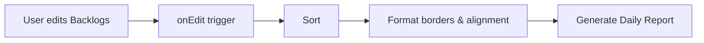
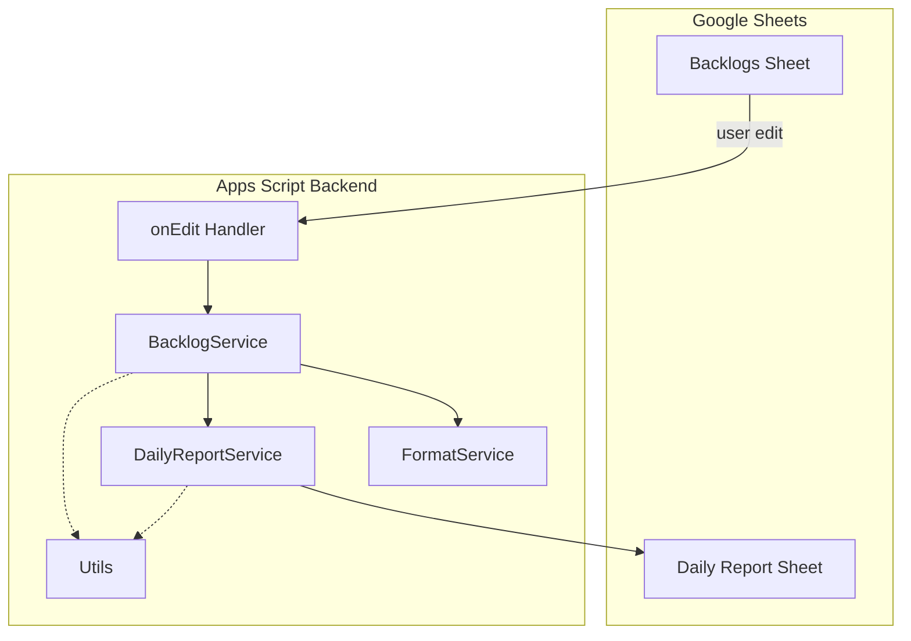
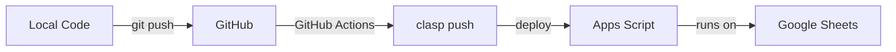

# SheetFlow

A spreadsheet-based workflow engine and reporting system built on Google Sheets + Apps Script.

## What is SheetFlow?

SheetFlow turns Google Sheets into a lightweight task manager with automated sorting, visual grouping, and daily report generation. No external tools needed — everything runs inside your spreadsheet.

## Features

- **Task Pinning** — Pin important tasks to keep them at the top of your list
- **Smart Auto-sort** — Backlogs automatically sort with pinned tasks first, then by date (newest first), priority, and project
- **Visual grouping** — Borders separate pinned tasks from unpinned tasks, tasks without dates from dated tasks, and different date groups
- **Daily Report** — Tasks are grouped by project and synced to a Daily Report sheet
- **Finished tracking** — Completed tasks are filtered and displayed separately
- **Concurrency safe** — LockService prevents conflicts during rapid edits
- **One-click recovery** — `refreshAll()` resyncs everything manually

## How it works



Backlogs sheet acts as the database. Daily Report sheet is a materialized view that rebuilds automatically.

## Architecture



## Deployment Pipeline



## Sheets Structure

### Backlogs

| Column | Field     | Description |
|--------|-----------|-------------|
| A      | Project   | Project name |
| B      | Task      | Task description |
| C      | Priority  | High/Medium/Low |
| D      | Status    | Todo/In Progress/Done |
| E      | Work Date | Date for the work |
| F      | Note      | Additional notes |
| G      | Pinned    | ✓ Check to pin task to top |

### Task Pinning

Tasks are sorted with this priority:
1. **Pinned tasks first** (those with ✓ in column G)
2. **Date descending** within pinned/unpinned groups (newest first)
3. **Priority ascending** for tasks with same date
4. **Project ascending** as final tiebreaker

**Visual grouping**: Borders visually separate:
- Pinned tasks from unpinned tasks
- Tasks without dates from tasks with dates
- Different date groups within dated tasks

### Daily Report

| Column | Field           |
|--------|-----------------|
| A      | Date            |
| B      | Check-in        |
| C      | Check-out       |
| D      | Total Hours     |
| E      | Daily Goals     |
| F      | Tasks Completed |

## Tech Stack

- Google Sheets
- Google Apps Script (V8)
- [clasp](https://github.com/google/clasp) for local development
- GitHub Actions for CI/CD

## Getting Started

1. Clone the repo
2. Install clasp: `npm install -g @google/clasp`
3. Login: `clasp login`
4. Go to `SheetFlow.AppScript/`
5. Link your Apps Script project: update `scriptId` in `.clasp.json`
6. Push: `clasp push`

## Deployment

See the pipeline diagram above. Push to `main` triggers automatic deployment.

See [docs/CICD.md](docs/CICD.md) for full setup guide.

## Project Structure

```
├── SheetFlow.AppScript/
│   ├── appsscript.json
│   ├── .clasp.json.example
│   ├── src/
│   │   ├── config.gs
│   │   ├── utils.gs
│   │   ├── sort.service.gs
│   │   ├── format.service.gs
│   │   ├── backlog.service.gs
│   │   ├── dailyreport.service.gs
│   │   ├── api.service.gs
│   │   └── main.gs
│   └── test/
│       ├── test.runner.gs
│       ├── sort.service.test.gs
│       └── border.test.gs
├── SheetFlow.FlutterMobile/ # Flutter mobile client
└── docs/                    # Documentation
```

## Testing & Quality

### Local Testing
```bash
# Setup
cd SheetFlow.AppScript
clasp login
cp .clasp.json.example .clasp.json
# Edit .clasp.json với scriptId

# Deploy & test
clasp push
clasp open

# Run tests trong Apps Script Editor
# → test/test.runner.gs → runAllTests()
```

### CI Pipeline
- **Test CI**: Chạy trên PR/push - validate code quality
- **Deploy CD**: Chỉ chạy trên main - deploy to Apps Script

## Documentation

| Doc | Description |
|-----|-------------|
| [Overview](docs/OVERVIEW.md) | Project introduction and background |
| [Architecture](docs/ARCHITECTURE.md) | Service-layer design and data flow |
| [Roadmap](docs/ROADMAP.md) | Development phases and task checklist |
| [CI/CD](docs/CICD.md) | GitHub Actions + clasp deployment |
| [Agents](docs/AGENTS.md) | Conventions for coding agents |
| [Local Testing](SheetFlow.AppScript/test/LOCAL_TEST_GUIDE.md) | How to run tests locally |
| [Test Automation](SheetFlow.AppScript/test/AUTOMATION_GUIDE.md) | Advanced testing strategies |

## License

Personal project. Not licensed for redistribution.
