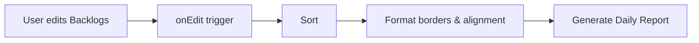
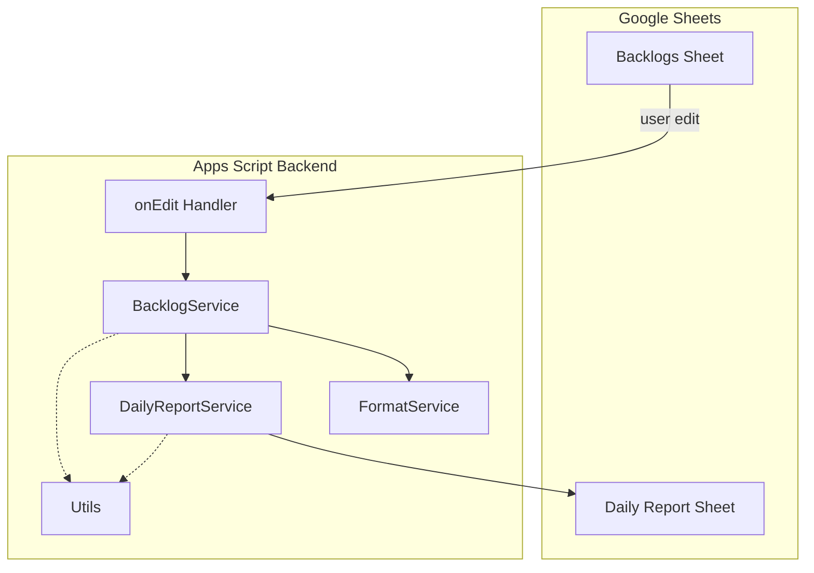
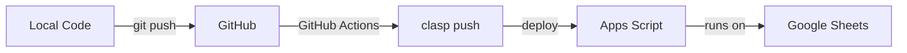

# SheetFlow

A spreadsheet-based workflow engine and reporting system built on Google Sheets + Apps Script.

## What is SheetFlow?

SheetFlow turns Google Sheets into a lightweight task manager with automated sorting, visual grouping, and daily report generation. No external tools needed — everything runs inside your spreadsheet.

## Features

- **Auto-sort** — Backlogs automatically sort by date, status, priority, and project when you edit
- **Visual grouping** — Date borders separate tasks into clean visual blocks
- **Daily Report** — Tasks are grouped by project and synced to a Daily Report sheet
- **Finished tracking** — Completed tasks are filtered and displayed separately
- **Concurrency safe** — LockService prevents conflicts during rapid edits
- **One-click recovery** — `refreshAll()` resyncs everything manually

## How it works

Backlogs sheet acts as the database. Daily Report sheet is a materialized view that rebuilds automatically.

## Architecture

## Deployment Pipeline

## Sheets Structure

### Backlogs

| Column | Field     |
|--------|-----------|
| A      | Project   |
| B      | Task      |
| C      | Priority  |
| D      | Status    |
| E      | Work Date |
| F      | Note      |

### Daily Report

| Column | Field           |
|--------|-----------------|
| A      | Date            |
| B      | Check-in        |
| C      | Check-out       |
| D      | Total Hours     |
| E      | Daily Goals     |
| F      | Tasks Completed |

## Tech Stack

- Google Sheets
- Google Apps Script (V8)
- [clasp](https://github.com/google/clasp) for local development
- GitHub Actions for CI/CD

## Getting Started

1. Clone the repo
2. Install clasp: `npm install -g @google/clasp`
3. Login: `clasp login`
4. Link your Apps Script project: update `scriptId` in `.clasp.json`
5. Push: `clasp push`

## Deployment

See the pipeline diagram above. Push to `main` triggers automatic deployment.

See [docs/CICD.md](docs/CICD.md) for full setup guide.

## Documentation

| Doc | Description |
|-----|-------------|
| [Overview](docs/OVERVIEW.md) | Project introduction and background |
| [Architecture](docs/ARCHITECTURE.md) | Service-layer design and data flow |
| [Roadmap](docs/ROADMAP.md) | Development phases and task checklist |
| [CI/CD](docs/CICD.md) | GitHub Actions + clasp deployment |
| [Agents](docs/AGENTS.md) | Conventions for coding agents |

## License

Personal project. Not licensed for redistribution.
