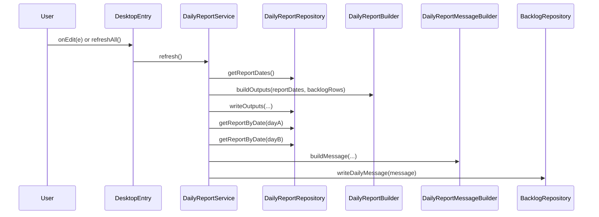

# SheetFlow - Architecture

## Current Structure

`SheetFlow.AppScript` uses a layered structure inside `src/`:

```text
src/
  app/           # Global Apps Script entrypoints
  api/           # Flutter-facing HTTP modules
  config/        # App config + sheet schema
  domain/        # Mapping, sorting, formatting, and report building
  repositories/  # Spreadsheet / Script Properties access
  services/      # Desktop use-case orchestration
  shared/        # Utils, logging, response helpers
```

## Client Boundaries

### Desktop client

- Users work directly in Google Sheets
- Entry points:
  - `onEdit(e)`
  - `refreshAll()`
- Flow:
  - `app/main.gs` -> `DesktopEntry` -> services -> repositories/domain

### Flutter client

- Mobile app calls the Apps Script web app over HTTP
- Entry points:
  - `doGet(e)`
  - `doPost(e)`
- Flow:
  - `app/main.gs` -> `ApiEntry` -> `api/router.gs` -> API modules -> repositories/domain

## Layer Responsibilities

| Layer | Responsibility |
|---|---|
| `config/` | Centralize sheet coordinates, app constants, and runtime configuration |
| `shared/` | Common helpers such as date formatting, logging, and JSON response helpers |
| `domain/` | Pure or near-pure logic for sorting, grouping, formatting, and report composition |
| `repositories/` | The only layer that directly accesses `SpreadsheetApp` and `PropertiesService` |
| `services/` | Orchestrate desktop use cases and refresh flows |
| `api/` | Expose mobile-facing routes and request handling |
| `app/` | Keep global Apps Script entrypoints minimal |

## Data Model

### Backlogs sheet

| Column | Field | Meaning |
|---|---|---|
| A | `project` | Project name |
| B | `task` | Task name |
| C | `priority` | Priority |
| D | `status` | Status |
| E | `workDate` | Work date |
| F | `note` | Note |
| G | `pinned` | Pinned |

Additional writeback area:
- `K2` stores the final composed daily report message

### Daily Report sheet

| Column | Meaning |
|---|---|
| A | Report date |
| E | Goals / planned work |
| F | Finished work |

## Key Modules

Relevant modules for daily reporting:
- `src/domain/daily-report.builder.gs`
- `src/domain/daily-report-message.builder.gs`
- `src/repositories/daily-report.repository.gs`
- `src/repositories/backlog.repository.gs`
- `src/services/daily-report.service.gs`

## Runtime Flow

### Desktop flow

```text
User edits Backlogs
  ->
onEdit(e)
  ->
DesktopEntry
  ->
BacklogService.handleEdit()
  ->
TaskSorter + BacklogFormatter + BacklogRepository
  ->
DailyReportService.refresh()
  ->
DailyReportBuilder + DailyReportRepository
  ->
DailyReportMessageBuilder + BacklogRepository.writeDailyMessage()
```

### Flutter API flow

```text
Flutter HTTP request
  ->
doGet / doPost
  ->
ApiEntry
  ->
ApiRouter
  ->
ApiAuth + ApiTasks / ApiReports
  ->
Repositories + Domain
```

## Daily Report Matrix Generation

The structured daily report matrix groups data as:

`Date -> Project -> Tasks`

Output cell format:

```text
1. Project A
- Task 1
- Task 2
2. Project B
- Task 3
```

Finished tasks are filtered with:

`status.toLowerCase() === "finished"`

## Daily Report Message Generation

The final message is a second-stage composition flow built on top of the `Daily Report` sheet.

### Runtime rule

- if execution time is before `09:00`, `dayA = yesterday`
- otherwise, `dayA = today`
- `dayB = dayA + 1 day`

### Source contract

- `report(dayA).finished` comes from `Daily Report!F`
- `report(dayB).goals` comes from `Daily Report!E`

### Output contract

- write the final multiline message into `Backlogs!K2`

## Sequence Diagram



## Formatting Rules

### Borders

- Compare task groups:
  - `PINNED`
  - `NO_DATE`
  - `DATED_yyyy-MM-dd`
- When the group changes between adjacent rows, draw a `SOLID_MEDIUM` top border

### Alignment

| Column | Alignment |
|---|---|
| A | Center |
| B | Left |
| C | Center |
| D | Center |
| E | Center |
| F | Center |
| G | Center |
