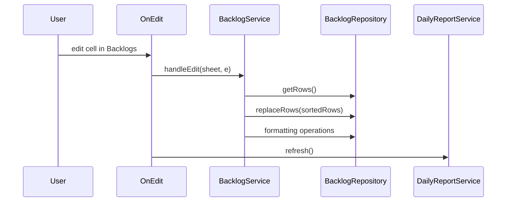
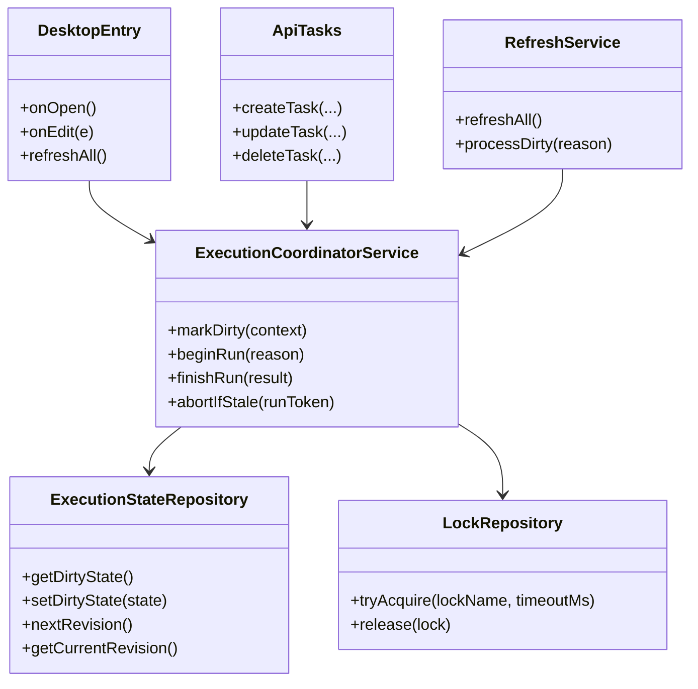
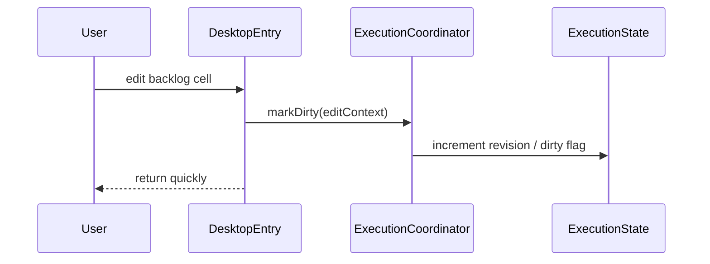
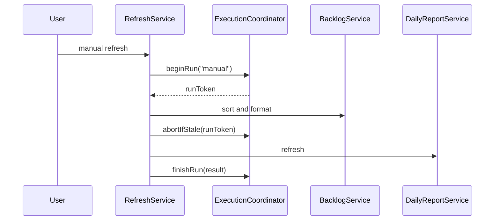
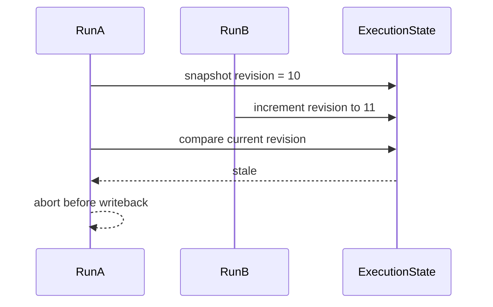

# Concurrency And Performance Source Code Guide

## Relevant Existing Modules

- `src/app/desktop.entry.gs`
- `src/services/backlog.service.gs`
- `src/services/refresh.service.gs`
- `src/services/daily-report.service.gs`
- `src/repositories/backlog.repository.gs`
- `src/repositories/script-properties.repository.gs`
- `src/api/tasks.gs`
- `src/api/router.gs`

## Current Problematic Flow

Problems in this flow:
- one edit causes full recomputation
- overlapping executions can both read and write the same sheet snapshot
- full-range writeback increases lost-update risk

## Proposed Architecture

### New modules

Implemented additions:
- `src/services/execution-coordinator.service.gs`
- `src/repositories/lock.repository.gs`
- `src/repositories/execution-state.repository.gs`

### Responsibility split

#### `ExecutionCoordinatorService`
- acquire execution lock
- mark dirty state
- assign and compare run tokens
- decide whether to process, skip, or abort

#### `ExecutionStateRepository`
- persist dirty flags
- persist revision / generation numbers
- persist current run metadata

#### `LockRepository`
- wrap `LockService`
- expose lock acquisition and release in one place

#### `RefreshService`
- become the only heavy processing entrypoint
- consume coordinator decisions instead of running unguarded

## Target Interaction Model

## Recommended Sequence

### Desktop edit flow

### Manual refresh flow

### Overlapping execution protection

## Key Refactor Points

### `DesktopEntry.onEdit()`

Current:
- directly triggers heavy backlog sort and daily report refresh

Target:
- validate edit range
- mark dirty
- return quickly

### `RefreshService.refreshAll()`

Current:
- directly runs heavy work

Target:
- become the single controlled path for heavy work
- only run through coordinator lock + stale checks
- expose a guarded worker path via `processDirty(...)`

### `ApiTasks`

Current:
- create/update/delete immediately call `RefreshService.refreshAll()`

Target:
- write task data
- mark dirty and attempt coordinated processing
- avoid bypassing the concurrency model

## Suggested Persistent State

Store in script properties:
- `BACKLOG_DIRTY=true|false`
- `BACKLOG_REVISION=<number>`
- `BACKLOG_LAST_RUN_AT=<timestamp>`
- `BACKLOG_LAST_RUN_REASON=<manual|api|desktop>`
- `BACKLOG_RUNNING_TOKEN=<token>`

## Notes On Performance

Primary performance gain should come from execution model changes, not micro-optimizations.

The most important wins are:
- fewer heavy runs
- one serialized worker at a time
- fewer full-range rewrites
- fewer repeated formatting calls
