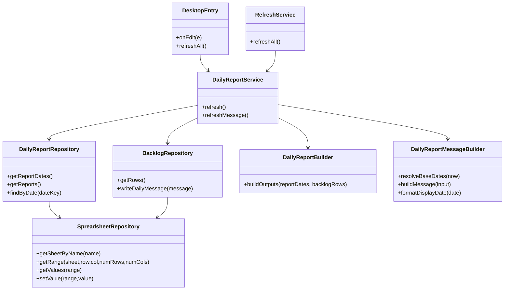
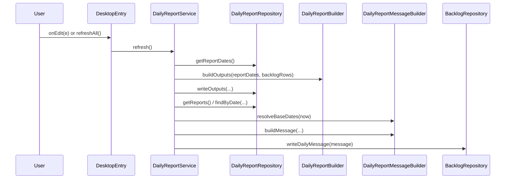
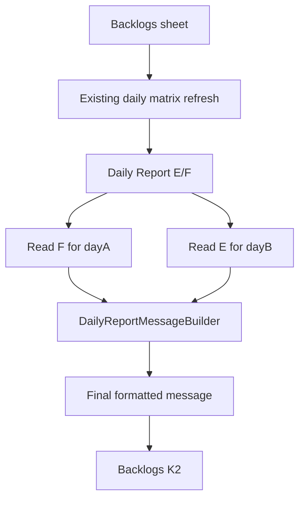

# Daily Report Message Source Code Guide

## Target Modules

Existing modules involved:
- `src/services/daily-report.service.gs`
- `src/repositories/daily-report.repository.gs`
- `src/repositories/backlog.repository.gs`
- `src/config/sheet.schema.gs`
- `src/config/app.config.gs`

Planned new module:
- `src/domain/daily-report-message.builder.gs`

## Responsibility Split

### `DailyReportService`
- orchestrates refresh flow
- keeps existing matrix refresh behavior
- triggers final message generation and writeback

### `DailyReportRepository`
- reads report rows from `Daily Report`
- exposes lookup by report date

### `BacklogRepository`
- writes the final composed message into `Backlogs!K2`

### `DailyReportMessageBuilder`
- resolves `dayA` and `dayB`
- formats dates for display
- composes the final message template

## Module Diagram



## Refresh Sequence



## Data Flow



## Core Logic Notes

### Date resolution

Recommended behavior:
- if current time is before `09:00`, use yesterday as `dayA`
- otherwise use today as `dayA`
- derive `dayB` from `dayA + 1 day`

### Section mapping

The final message uses:
- `completedText = report(dayA).finished`
- `todayText = report(dayB).goals`

This mapping must stay explicit in code because the source columns are intentionally asymmetric.

### Write target

The final string should be written to a single cell:
- sheet: `Backlogs`
- cell: `K2`

This location must be defined in schema/config, not repeated inline.

## Suggested Function Shape

```text
DailyReportService.refresh()
  -> refreshDailyMatrix()
  -> refreshDailyMessage(now)

DailyReportMessageBuilder.resolveBaseDates(now)
  -> { dayA, dayB, cutoffHour }

DailyReportMessageBuilder.buildMessage({
  dayA,
  dayB,
  completedText,
  todayText,
  spreadsheetUrl
})
  -> finalMessage
```

## Test Surface

Functions that should remain easy to test:
- base date resolution
- display date formatting
- message template composition
- empty-section fallback behavior
